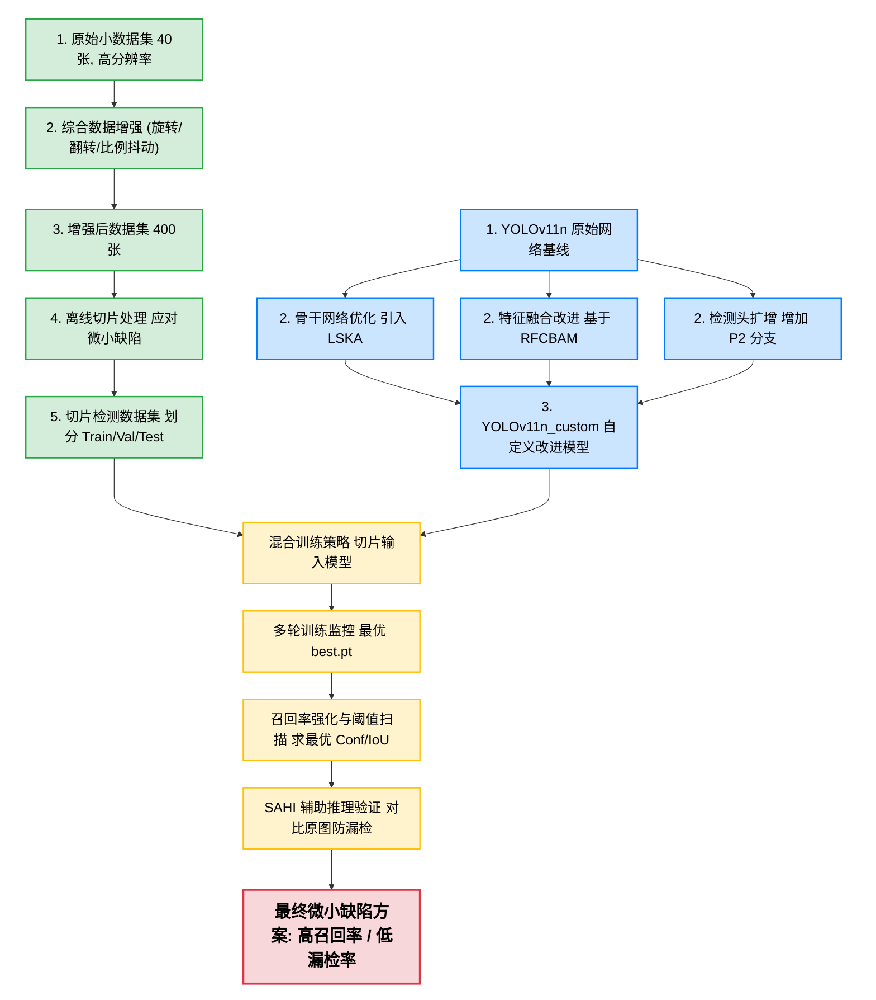

# 光伏电池缺陷检测算法流程图

```mermaid
%%{init: {"theme": "default", "themeVariables": {"background": "#ffffff", "fontSize": "20px"}, "flowchart": {"rankSpacing": 40, "nodeSpacing": 40}}}%%
flowchart TB
    classDef default fill:#f9f9f9,stroke:#333,stroke-width:2px,color:#000,font-size:20px;
    classDef data fill:#d4edda,stroke:#28a745,stroke-width:2px,color:#000,font-size:20px;
    classDef model fill:#cce5ff,stroke:#007bff,stroke-width:2px,color:#000,font-size:20px;
    classDef train fill:#fff3cd,stroke:#ffc107,stroke-width:2px,color:#000,font-size:20px;
    classDef output fill:#f8d7da,stroke:#dc3545,stroke-width:3px,color:#000,font-size:24px,font-weight:bold;

    subgraph DataFlow [" "]
        direction LR
        A["1. 原始小数据集 40张, 高分辨率"]:::data --> B["2. 综合数据增强 (旋转/翻转/比例抖动)"]:::data
        B --> C["3. 增强后数据集 400张"]:::data
        C --> D["4. 离线切片处理 应对微小缺陷"]:::data
        D --> E["5. 切片检测数据集 划分 Train/Val/Test"]:::data
    end

    subgraph ModelFlow [" "]
        direction LR
        F["1. YOLOv11n 原始网络基线"]:::model --> G1["2. 骨干网络优化 引入 LSKA"]:::model
        F --> G2["2. 特征融合改进 基于 RFCBAM"]:::model
        F --> G3["2. 检测头扩增 增加 P2 分支"]:::model
        
        G1 --> H["3. YOLOv11n_custom 自定义改进模型"]:::model
        G2 --> H
        G3 --> H
    end

    subgraph TrainFlow [" "]
        direction LR
        I["混合训练策略 切片输入模型"]:::train --> J["多轮训练监控 最优 best.pt"]:::train
        J --> K["召回率强化与阈值扫描 求最优 Conf/IoU"]:::train
        K --> L["SAHI 辅助推理验证 对比原图防漏检"]:::train
    end

    E --> I
    H --> I
    L --> M["最终微小缺陷方案: 高召回率 / 低漏检率"]:::output

    style DataFlow fill:none,stroke:none,stroke-width:0px;
    style ModelFlow fill:none,stroke:none,stroke-width:0px;
    style TrainFlow fill:none,stroke:none,stroke-width:0px;
```
